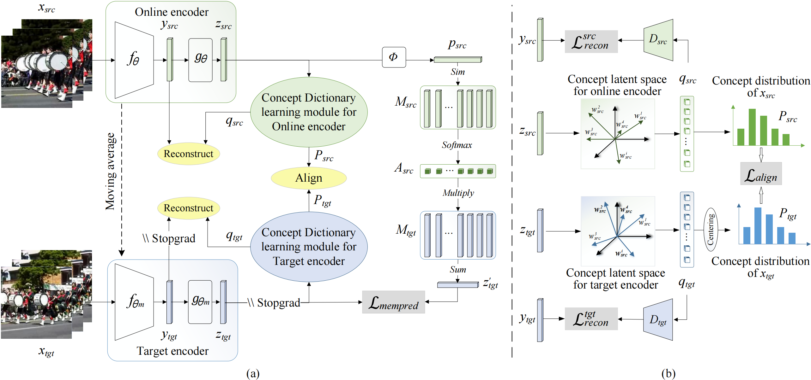

# Fine-grained Key-Value Memory Enhanced Predictor for Video Representation Learning (ACM MM 2023).



This repository is the official implementation of "Fine-grained Key-Value Memory Enhanced Predictor for Video Representation Learning", presented at ACM Multimedia 2023. This codebase is designed to facilitate video representation learning by leveraging a novel Fine-grained Key-Value Memory Enhanced Predictor (FGKVMem) approach, enhancing the predictive capabilities for video understanding tasks. Our implementation builds on the SlowFast architecture, extending it with our FGKVMemPred module to achieve superior performance in video representation learning methods.

> [**Fine-grained Key-Value Memory Enhanced Predictor for Video Representation Learning (ACM MM 2023)**](https://github.com/xiaojieli0903/FGKVMemPred_video/blob/main/Fine%20grained%20Key%20Value%20Memory%20Enhanced%20Predictor%20for%20Video%20Representation%20Learning.pdf)  
> Xiaojie Li^1,2, [Jianlong Wu](https://jlwu1992.github.io)*^1 (Corresponding Author), Shaowei He^1, Shuo Kang^3, [Yue Yu](https://yuyue.github.io)^2, [Liqiang Nie](https://liqiangnie.github.io)^1, [Min Zhang](https://zhangminsuda.github.io)^1  
> ^1Harbin Institute of Technology, Shenzhen, ^2Peng Cheng Laboratory, ^3Sensetime Research


## 🔨 Installation

To get started with our project, please follow these setup instructions:

1. **Environment Setup with Conda:**
   Create a Conda environment specifically for this project to manage dependencies efficiently.
   ```bash
   conda create -n pytorch_env python=3.8 pytorch=1.13.1 torchvision=0.14.1 torchaudio=0.13.1 cudatoolkit=11.7 -c pytorch -c nvidia
   ```

2. **Install Required Python Packages:**
   Install all necessary Python packages listed in `requirements.txt` using pip.
   ```bash
   pip install -r requirements.txt
   ```

3. **Set Up Detectron2 with Modifications:**
   Clone the Detectron2 repository and install it. Then, replace certain files with our modified versions to enhance functionality.
   ```bash
   git clone https://github.com/facebookresearch/detectron2.git
   pip install -e detectron2
   # Replace files in pytorchvideo package with our modified versions
   cp tools/modified_files/distributed.py $(python -c 'import pytorchvideo; print(pytorchvideo.__path__[0])')/layers/
   cp tools/modified_files/batch_norm.py $(python -c 'import pytorchvideo; print(pytorchvideo.__path__[0])')/layers/
   ```

4. **Clone FGKVMemPred Repository:**
   Get our project repository containing all the necessary code and scripts.
   ```bash
   git clone https://github.com/xiaojieli0903/FGKVMemPred_video.git
   ```

5. **Add Project to PYTHONPATH:**
   Ensure Python can find the project modules by adding it to your PYTHONPATH.
   ```bash
   export PYTHONPATH=$(pwd)/FGKVMemPred_video/slowfast:$PYTHONPATH
   ```

6. **Build FGKVMemPred_video:**
   Compile and install the project to make sure everything is set up correctly.
   ```bash
   cd FGKVMemPred_video
   python setup.py build develop
   ```

## ➡️ Data Preparation

This guide provides comprehensive steps for preparing the UCF101, HMDB51, and Kinetics400 datasets for use in the FGKVMemPred Video Understanding project. Follow these instructions to ensure your datasets are correctly formatted and ready for model training and evaluation.

**✨ UCF101**
1. **Download Videos:**
   - Acquire the UCF101 dataset from the [official source](https://www.crcv.ucf.edu/data/UCF101.php).

2. **Structure the Dataset:**
   Organize the dataset to follow this directory structure:
   ```
   {your_path}/UCF101/videos/{action_class}/{video_name}.avi
   {your_path}/UCF101/ucfTrainTestlist/trainlist{01/02/03}.txt
   {your_path}/UCF101/ucfTrainTestlist/testlist{01/02/03}.txt
   ```

3. **Symbolic Links for Dataset Splits:**
   Create symbolic links to the dataset split lists for streamlined script processing:
   ```
   ln -s {your_path}/UCF101/ucfTrainTestlist/trainlist01.txt {your_path}/UCF101/train.csv
   ln -s {your_path}/UCF101/ucfTrainTestlist/testlist01.txt {your_path}/UCF101/test.csv
   ln -s {your_path}/UCF101/ucfTrainTestlist/testlist01.txt {your_path}/UCF101/val.csv
   ```

**✨ HMDB51**
1. **Download Videos:**
   - Obtain the HMDB51 dataset from its [official source](http://serre-lab.clps.brown.edu/resource/hmdb-a-large-human-motion-database/#Downloads).

2. **Structure the Dataset:**
   Ensure the HMDB51 dataset is organized as follows:
   ```
   {your_path}/HMDB51/videos/{action_class}/{video_name}.avi
   {your_path}/HMDB51/split/testTrainMulti_7030_splits/{action_class}_test_split{1/2/3}.txt
   ```

3. **Generate and Resize CSV Files:**
   Use the provided script to generate CSV files for training, testing, and validation, and resize videos:
   ```
   python tools/dataset_tools/process_hmdb51.py {your_path}/HMDB51/split/testTrainMulti_7030_splits/ {your_path}/HMDB51/ <split_index>
   python tools/dataset_tools/resize_videos.py {your_path}/HMDB51/ videos {your_path}/HMDB51/train.csv
   python tools/dataset_tools/resize_videos.py {your_path}/HMDB51/ videos {your_path}/HMDB51/val.csv
   ```

**✨ Kinetics400**
1. **Download Videos:**
   - Download the Kinetics400 dataset using the [ActivityNet provided scripts](https://github.com/activitynet/ActivityNet/tree/master/Crawler/Kinetics).

2. **Structure and Resize the Dataset:**
   Organize and resize the Kinetics400 dataset to conform to the required structure and video dimensions:
   ```
   {your_path}/Kinetics400/videos/{split}/{action_class}/{video_name}.mp4
   {your_path}/Kinetics/kinetics_{split}/kinetics_{split}.csv
   ```
   - Use the script to resize videos to a short edge size of 256 pixels:
   ```
   python tools/dataset_tools/resize_videos.py {your_path}/Kinetics-400/ {split} {your_path}/Kinetics/kinetics_{split}/kinetics_{split}.csv
   ```

**✨ Notes**
- Ensure the `{your_path}` placeholder is replaced with the actual path to your datasets.
- The CSV files should list video paths and their corresponding labels, formatted as `'video_path label'`.
- The resizing step is crucial for standardizing input sizes across datasets, facilitating more efficient training and evaluation.

## ➡️ Quick Start

Once you've set up your environment and prepared your datasets, you're ready to dive into model training and evaluation. Before you begin, make sure to activate the `pytorch_env` Conda environment:

```bash
conda activate pytorch_env
```

**🎈Pretraining**

Our project utilizes the `dist_pretrain.sh` script for initiating self-supervised training sessions. This script requires you to specify several parameters:

- `$CONFIG`: The path to your model configuration file.
- `$PORT`: An available port number for distributed training.
- `$GPUS`: The number of GPUs you wish to utilize for training.
- `$LIST_PATH`: The directory path where your `train.csv` and `val.csv` files are located.
- `$PATH_PREFIX`: The prefix to append to each video path specified in your CSV files.

To launch a training session, use the following syntax:

```bash
sh scripts/dist_pretrain.sh $CONFIG $PORT $GPUS $LIST_PATH $PATH_PREFIX
```

For specific training configurations, refer to these examples (remember to adjust paths and parameters as necessary for your environment):

- **Pre-Training with an MLP Predictor:**
  
  ```bash
  sh scripts/dist_pretrain.sh configs/ucf101/r3d18/BYOL_SlowR18_16x4_112_400e_bs64_lr1.2_r3d18.yaml 12345 4 /path/to/ucf101/csv /path/to/ucf101/videos
  ```

- **Pre-Training with an Enhanced Key-Value Memory Predictor:**
  
  ```bash
  sh scripts/dist_pretrain.sh configs/ucf101/r3d18/BYOL_SlowR18_16x4_112_400e_bs64_lr1.2_r3d18_h1_mem4096_inproj_codealign_dino_dot_t0.05_synccenter.yaml 12345 4 /path/to/ucf101/csv /path/to/ucf101/videos
  ```

**🎈Evaluation**

To evaluate the performance of our self-supervised learning methods, we use action recognition as a downstream task. This involves initializing models with pre-trained parameters and either fine-tuning the entire network or conducting a linear probe.

To train the action classifier utilizing the pretrained weights (`$CHECKPOINT`), execute one of the following commands based on your dataset and evaluation method:

- **Fine-tuning:**

  ```bash
  sh scripts/run_finetune_ucf101.sh $CONFIG $CHECKPOINT $LIST_PATH $PATH_PREFIX $PORT
  sh scripts/run_finetune_HMDB51.sh $CONFIG $CHECKPOINT $LIST_PATH $PATH_PREFIX $PORT
  ```

- **Linear Probe:**

  ```bash
  sh scripts/run_linear_ucf101.sh $CONFIG $CHECKPOINT $LIST_PATH $PATH_PREFIX $PORT
  sh scripts/run_linear_HMDB51.sh $CONFIG $CHECKPOINT $LIST_PATH $PATH_PREFIX $PORT
  ```

These steps will guide you through both training and evaluating models with our video understanding framework. Adjust paths and parameters according to your specific setup to ensure successful execution.

- **Perform Test Only:**
We have `TRAIN.ENABLE` and `TEST.ENABLE` to control whether training or testing is required for the current job. If only testing is preferred, you can set the `TRAIN.ENABLE` to False, and do not forget to pass the path to the model you want to test to TEST.CHECKPOINT_FILE_PATH.
   ```
   python tools/run_net.py --cfg $CONFIG DATA.PATH_TO_DATA_DIR $LIST_PATH TEST.CHECKPOINT_FILE_PATH $CHECKPOINT TRAIN.ENABLE False
   ```

## 📍Model Zoo

| Model    |  Params (M)  | Pretraining Dataset |                                                    Pretrain                                                     |                                              Finetune on UCF101                                              |                                              Finetune on HMDB51                                              |                             LinearProbe on UCF101                              |                             LinearProbe on HMDB51                              |
|:---------|:------------:|:-------------------:|:---------------------------------------------------------------------------------------------------------------:|:------------------------------------------------------------------------------------------------------------:|:------------------------------------------------------------------------------------------------------------:|:------------------------------------------------------------------------------:|:------------------------------------------------------------------------------:|
| R3D-18   |     31.8     |    Kinetics-400     |   [config](configs/kinetics_pretrain/BYOL_R3D-18_16x4_112_100e_bs256_fgkvmempred.yaml) / [model](https://drive.google.com/file/d/1qUeXaGARb5HyUl8e2KIZmDRumIRxw-QN/view?usp=sharing) / [log](https://drive.google.com/file/d/1dmo0vQcWjWLiCfFUtQzpwqX9SdChRg3s/view?usp=sharing)    |   88.3 / [config](configs/finetune/finetune_R3D-18_syn_anyckpt_200e_mixup_lr0.2_preBN_warm5_drop0.5.yaml)    |   57.4 / [config](configs/finetune/finetune_R3D-18_syn_anyckpt_200e_mixup_lr0.2_preBN_warm5_drop0.5.yaml)    |   79.5 / [config](configs/linear/linear_R3D-18_syn_anyckpt_100e_lr0.1.yaml)    |   46.1 / [config](configs/linear/linear_R3D-18_syn_anyckpt_100e_lr0.1.yaml )   |
| R2+1D-18 |     14.4     |    Kinetics-400     | [config](configs/kinetics_pretrain/BYOL_R2plus1D-18_16x4_112_100e_bs256_fgkvmempred.yaml) / [model](https://drive.google.com/file/d/17cudYvdquGdGHagnyClcolZtwB5REmBC/view?usp=sharing) / [log](https://drive.google.com/file/d/1ecCcsQZeAzaaG9IwO_rlhGsFJerITZZi/view?usp=sharing) | 89.0 / [config](configs/finetune/finetune_R2plus1D-18_syn_anyckpt_200e_mixup_lr0.2_preBN_warm5_drop0.5.yaml) | 61.1 / [config](configs/finetune/finetune_R2plus1D-18_syn_anyckpt_200e_mixup_lr0.2_preBN_warm5_drop0.5.yaml) | 78.2 /[config](configs/linear/linear_R2plus1D-18_syn_anyckpt_100e_lr0.1.yaml)  | 47.6 / [config](configs/linear/linear_R2plus1D-18_syn_anyckpt_100e_lr0.1.yaml) |
| Slow-R18 |     20.2     |    Kinetics-400     |  [config](configs/kinetics_pretrain/BYOL_Slow-R18_8x8_224_100e_bs128_fgkvmempred.yaml) / [model](https://drive.google.com/file/d/1Wmtl2eizYo2dB90HQsHUDvwojYgYSGkE/view?usp=sharing) / [log](https://drive.google.com/file/d/1I895Csxngsk_viBMCdf_NedcgP1no4VK/view?usp=sharing)    | 87.5 /   [config](configs/finetune/finetune_Slow-R18_syn_anyckpt_200e_mixup_lr0.2_preBN_warm5_drop0.5.yaml)  | 57.1 /   [config](configs/finetune/finetune_Slow-R18_syn_anyckpt_200e_mixup_lr0.2_preBN_warm5_drop0.5.yaml)  |  79.6 / [config](configs/linear/linear_Slow-R18_syn_anyckpt_100e_lr0.1.yaml)   |  47.9 /  [config](configs/linear/linear_Slow-R18_syn_anyckpt_100e_lr0.1.yaml)  |
| R3D-18   |     31.8     |       UCF101        |           [config](configs/ucf101_pretrain/BYOL_R3d-18_16x4_112_400e_bs64.yaml) / [model](https://drive.google.com/file/d/15j3h-NAueMwh7bGbF90ue0GouY8UXBXl/view?usp=sharing) / [log](https://drive.google.com/file/d/1PVXiH90S7vbvHUGGxvlGj7FDzZ47tqHn/view?usp=sharing)           |  84.1 /   [config](configs/finetune/finetune_R3D-18_syn_anyckpt_200e_mixup_lr0.2_preBN_warm5_drop0.5.yaml)   | 54.2 /     [config](configs/finetune/finetune_R3D-18_syn_anyckpt_200e_mixup_lr0.2_preBN_warm5_drop0.5.yaml)  |  68.9 /    [config](configs/linear/linear_R3D-18_syn_anyckpt_100e_lr0.1.yaml)  | 36.5 /    [config](configs/linear/linear_R3D-18_syn_anyckpt_100e_lr0.1.yaml )  |
| R2+1D-18 |     14.4     |       UCF101        |  [config](configs/ucf101_pretrain/BYOL_R2plus1D-18_16x4_112_400e_bs64_fgkvmempred.yaml) / [model](https://drive.google.com/file/d/1wuGgu3NNThyAWWDHMkaTfN1doLgGYjsL/view?usp=sharing) / [log](https://drive.google.com/file/d/1NMyADycJxaSdbLOWrQ18KOIuZTR5jo2L/view?usp=sharing)    | 84.3 / [config](configs/finetune/finetune_R2plus1D-18_syn_anyckpt_200e_mixup_lr0.2_preBN_warm5_drop0.5.yaml) | 53.0 / [config](configs/finetune/finetune_R2plus1D-18_syn_anyckpt_200e_mixup_lr0.2_preBN_warm5_drop0.5.yaml) | 66.2 / [config](configs/linear/linear_R2plus1D-18_syn_anyckpt_100e_lr0.1.yaml) | 36.3 / [config](configs/linear/linear_R2plus1D-18_syn_anyckpt_100e_lr0.1.yaml) |

## ✏️ Citation

If you find this project useful for your research, please consider citing our paper:

```bibtex
@inproceedings{li2023fine,
  title={Fine-grained Key-Value Memory Enhanced Predictor for Video Representation Learning},
  author={Li, Xiaojie and Wu, Jianlong and He, Shaowei and Kang, Shuo and Yu, Yue and Nie, Liqiang and Zhang, Min},
  booktitle={Proceedings of the 31st ACM International Conference on Multimedia},
  pages={2264--2274},
  year={2023}
}
```

## 🔒 License

This project is made available under the [Apache 2.0 license](LICENSE).

## 👍 Acknowledgments

Special thanks to the creators of [SlowFast](https://github.com/facebookresearch/SlowFast) for their pioneering work in video understanding. Our project builds upon their foundation, and we appreciate their contributions to the open-source community.
